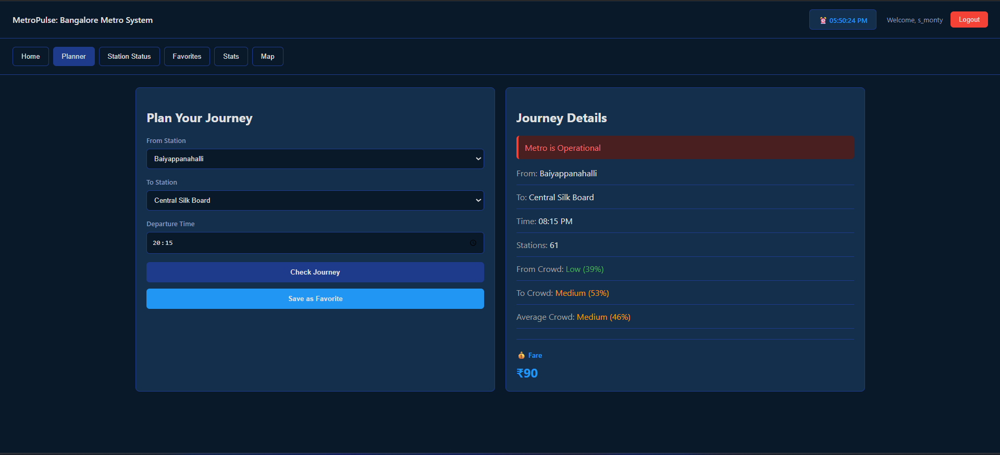

# Metro Pulse

Metro Pulse is a web application that analyzes metro station traffic and delays to give commuters a clearer picture of congestion levels and travel conditions across the metro network.

---

## Table of Contents

- [About](#about)
- [Screenshots](#screenshots)
- [Features](#features)
- [Tech Stack](#tech-stack)
- [Project Structure](#project-structure)
- [Getting Started](#getting-started)
  - [Prerequisites](#prerequisites)
  - [Installation](#installation)
  - [Environment Variables](#environment-variables)
  - [Running the App](#running-the-app)
- [API Overview](#api-overview)
- [Contributing](#contributing)
- [License](#license)

---

## About

Metro commutes are unpredictable — delays, overcrowded platforms, and no reliable way to plan ahead. Metro Pulse is built to fix that. It collects and visualizes traffic and delay data for metro stations, so commuters can check conditions before they leave and make smarter decisions about when and how to travel.

---

## Screenshots

**Home — Top 10 Busiest Stations**


**Journey Planner**


**Station Status by Line**


**Favorite Routes**


**Statistics & Analytics**


**Register**


---

## Features

- Live traffic dashboard showing congestion levels across all stations
- Journey planner with crowd levels, fare estimate, and departure time
- Station status filtered by metro line (Purple, Green, Yellow)
- Save and manage favorite routes per user account
- Statistics page with hourly crowd charts and weekly delay trends
- User authentication — register, login, and logout
- Responsive design that works on both desktop and mobile

---

## Tech Stack

**Frontend**
| Technology | Purpose |
|---|---|
| React.js | UI component framework |
| CSS | Styling and layout |
| HTML5 | Markup |

**Backend**
| Technology | Purpose |
|---|---|
| Node.js | Runtime environment |
| Express.js | REST API |
| MongoDB | Database |
| Mongoose | MongoDB object modeling |

---

## Project Structure

```
Metro-Pulse/
├── backend/
│   ├── models/
│   ├── routes/
│   ├── controllers/
│   └── server.js
│
├── frontend/
│   ├── public/
│   └── src/
│       ├── components/
│       ├── pages/
│       └── App.js
│
├── screenshots/
├── .gitignore
└── README.md
```

---

## Getting Started

### Prerequisites

- [Node.js](https://nodejs.org/) v16 or above
- npm or yarn
- [MongoDB](https://www.mongodb.com/) — local or via [MongoDB Atlas](https://www.mongodb.com/cloud/atlas)

---

### Installation

Clone the repository:

```bash
git clone https://github.com/smonty-19/Metro-Pulse.git
cd Metro-Pulse
```

Install backend dependencies:

```bash
cd backend
npm install
```

Install frontend dependencies:

```bash
cd ../frontend
npm install
```

---

### Environment Variables

Create a `.env` file inside the `backend/` folder:

```env
PORT=5000
MONGO_URI=your_mongodb_connection_string
```

Make sure this file is never committed — it's already covered by `.gitignore`.

---

### Running the App

Start the backend:

```bash
cd backend
npm start
```

The API will be running at `http://localhost:5000`.

In a separate terminal, start the frontend:

```bash
cd frontend
npm start
```

The app will open at `http://localhost:3000`.

---

## API Overview

| Method | Endpoint | Description |
|---|---|---|
| `GET` | `/api/stations` | Get all metro stations |
| `GET` | `/api/stations/:id` | Get details for a specific station |
| `GET` | `/api/stations/:id/traffic` | Get traffic data for a station |
| `GET` | `/api/delays` | Get current delay information |
| `POST` | `/api/stations/:id/report` | Submit a congestion report |

Base URL: `http://localhost:5000/api`

---

## Contributing

Pull requests are welcome. If you want to work on something significant, open an issue first so we can discuss the approach.

1. Fork the repo
2. Create your branch — `git checkout -b feature/your-feature`
3. Commit your changes — `git commit -m 'Add your feature'`
4. Push — `git push origin feature/your-feature`
5. Open a pull request

---

## License

This project is open-source under the [MIT License](LICENSE).
